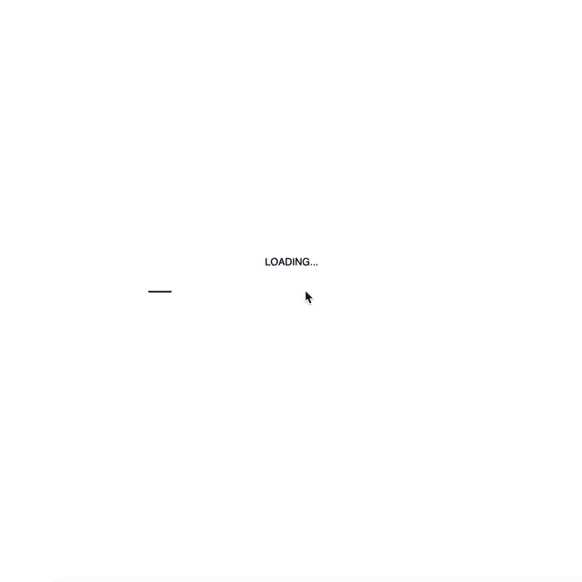

# Comply by Roby Manlongat

Based on [“OK Texts”](http://digbeyond.com/readme/JPG/OK_Texts_from_Meta_data_A_Digital_Poetics_sm.pdf) by Mark Amerika. A piece of writing which I found quite harsh and distressing. It is very critical of society the unquestioning reliance humans have formed with technology/machines and the total control they have on us.

For my retelling of the writing, statements will be shown one by one to the reader and each time the reader chooses to agree with one, they are given facebook likes. The reader continues to comply with their phone’s/laptop’s wishes until they are given their ultimate prize. 

I wanted to play on the social media theme of always wanting more and not being content with what we already have. We aim to get the most amount of likes as possible and for what? 

From my code, I want the readers to question themselves and think about the amount of times that they didn’t completely read the error message that popped up on their screen and just pressed “OK” to get rid of the disturbance. How often do they agree to something that they’ve only half read, to only realise what they’ve done when it’s too late. Eg. terms and conditions, contracts etc.

Once the reader reaches the end, I wanted them to think about if it was worth getting a ‘virus’ and agreeing to all those horrid statements just to get more likes. If we continue to focus on the number of likes that we get, accept the warnings and errors, what will the end result be?

**Click [here](https://robymanlongat.github.io/c0dewords/week12/majorProject_finalefinale) to view!**

**Hope you enjoy :)**
