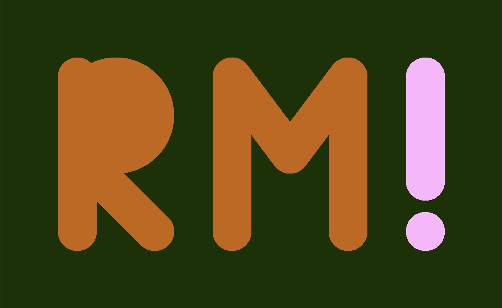

# welcome to code+words! :) 

## Virtual Worlds

We started the course and the semester by firstly meeting in *Minecraft* where a virtual Flinders St was created. While walking around and dismantling the roads, our class discussed how important virtual spaces like these have become in the technology age, especially in the time of COVID. We also discussed all of the possibilites in these worlds, specifically with retelling stories.

## Code

Next, we were introduced to coding and the program to do it on, *Processing*. I was able to produce my [initials](https://robymanlongat.github.io/codewords.github.io/week01/initialsInteractive) and also add some interactive elements to it! I found it quite difficult to understand everything at first, especially getting used to the y-axis decreasing from the bottom, instead of increasing which is what I'm so used to.  
