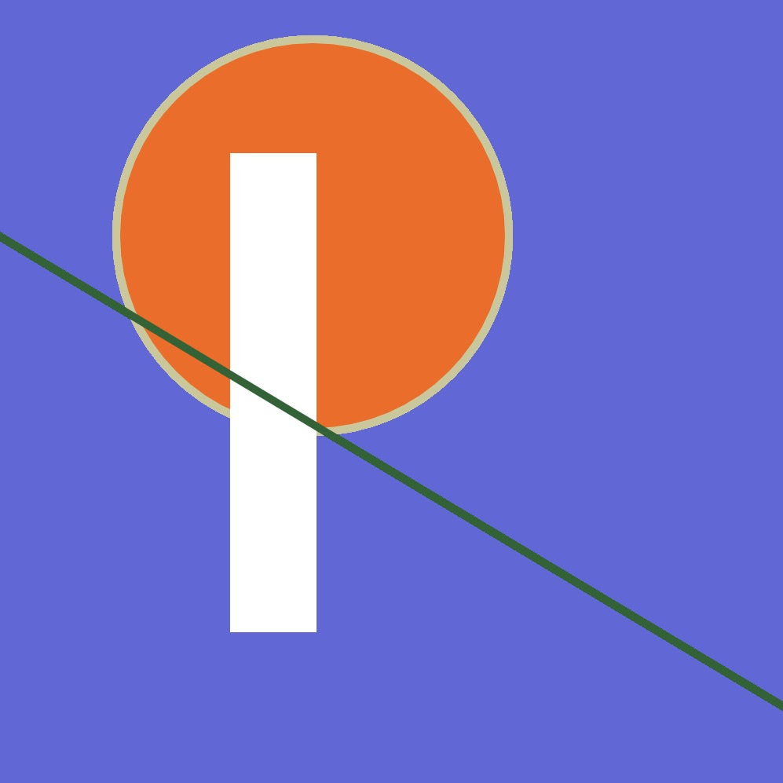

# code + words week 2!

## Modular Typefaces

This week, we discussed modular typeface designs. We gathered fonts and artists from the internet and presented our best finds to each other. I came across the female typographer, Fanette Mellier and her type *Multipli*, that was created referring to a poster folding principle. The letters appear from the folds and the back of the subtracted shapes make new colors arise. I found Mellier's decision to colour the back of the posters different from the front very clever.

After the class shared each of their fonts, we gathered that a lot of typographers, even up to now, start with the foundations of particular artists' works, especially Anh Sang Soo's. 

## Brief 2

Everyone then decided on which virtual world they would like for Brief 2. I chose to join the *Wholesome Animal Crossing/ Forever in Tom Nook's Debt Animal Crossing* group because I thought that since it is such an innocent and cute game, performing the horror novel would result in something super great. I think that players of Animal Crossing are also able to customise and edit enough, to be able to capture specific moods and tell stories.

We chose to re-read section 3. I can't wait to see what we will be able to come up with for this project!

## Code

[(over here!)](https://robymanlongat.github.io/c0dewords/week02/R)
After seeing some of my classmates experimental letters that they created through code, I wanted to see if I could come up with something different to what I did last week. I'm still trying to get used to the numbering system and even the values of the different colours. (now that I look at this, the diagonal stem doesn't appear to be strong enough, resulting in it to look more like a P rather than an R.)
