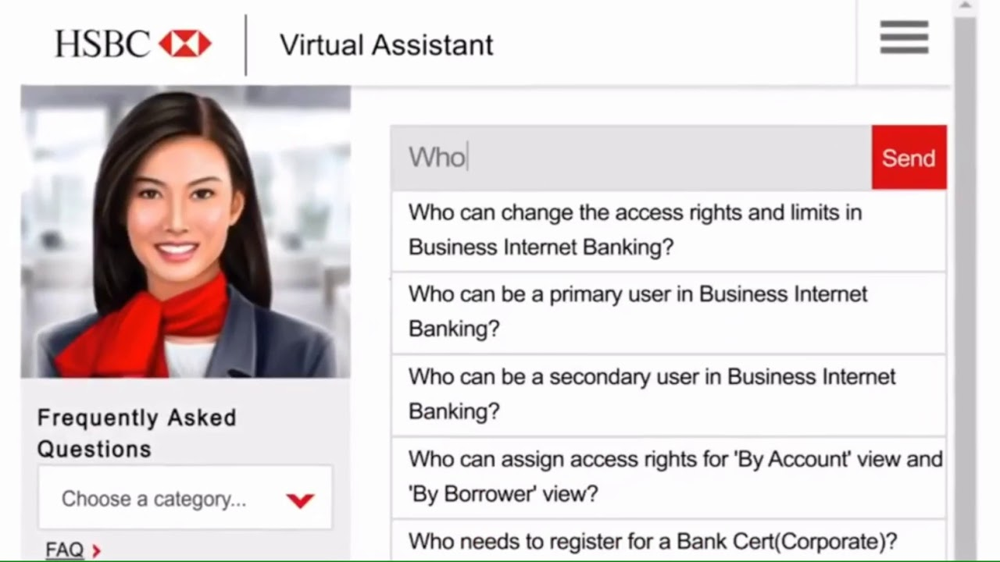
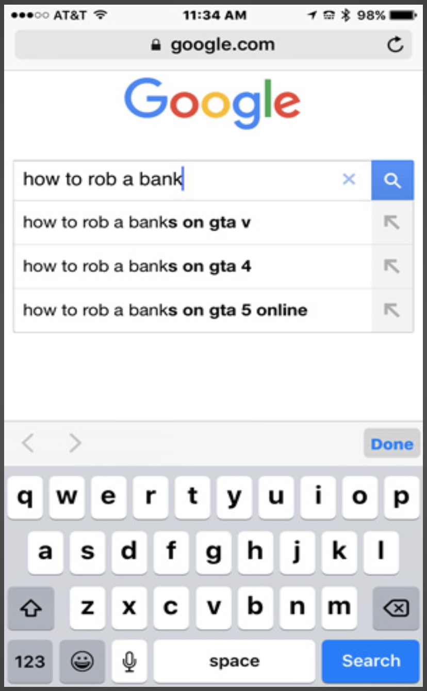

# code words, week three

## Virtual Identities

This week, we looked at avatars and virtual identities. We were also introduced to electronic literature and the different ways that have been explored to tell stories such as the creation of Chatbots, Generative Texts and the Animation of Texts. I honestly found this quite intimidating and scary as identities of actual people have been recreated and it could easily be turned around and used for the wrong reasons. 

## Interactive Text

We were asked to look online for as many interesting examples of these as we could. I found an [interactive text](https://webyarns.com/howto/howto.html) that retold the classic, *Bonnie and Clyde* more suitable for this "digital age". While clicking through this story, I was very interested to see what the artist had come up with for whatever was coming up next. He incorporated everyday actions that we make on our phones such as searching for instructions on Google, creating a casual vibe for such an intense story. I would like to try and recreate this casual vibe for my re-reading for Brief 3.

## Brief 2 

We were given the rest of the lesson to work with our groups on Brief 2. Firslty, my group and I decided to attempt to meet up at someone's Animal Crossing island. Initially we wanted to try Jamie's as he had the best island rating. I'm not entirely sure why but we couldn't manage to get all five of us over, everytime the fourth or fifth was in the processes of "flying over", the connection would drop out and we would all be kicked off the island. After a while, we decided to try on my (3 star :/) island and thankfully it worked! This was definitely something we would have to keep in mind while filming as our goal was to film as soon as possible so that we would be left with lots of time for editing and re-working with any feedback that could be given. 
