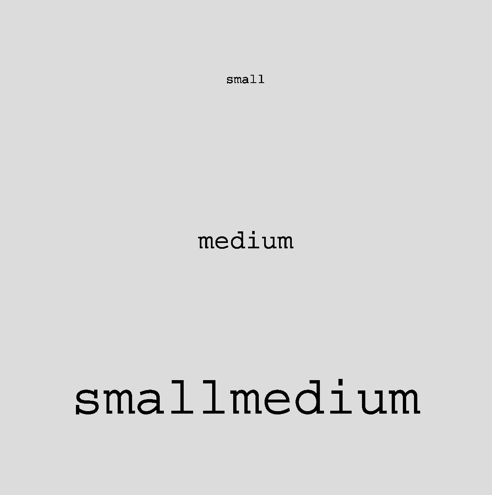
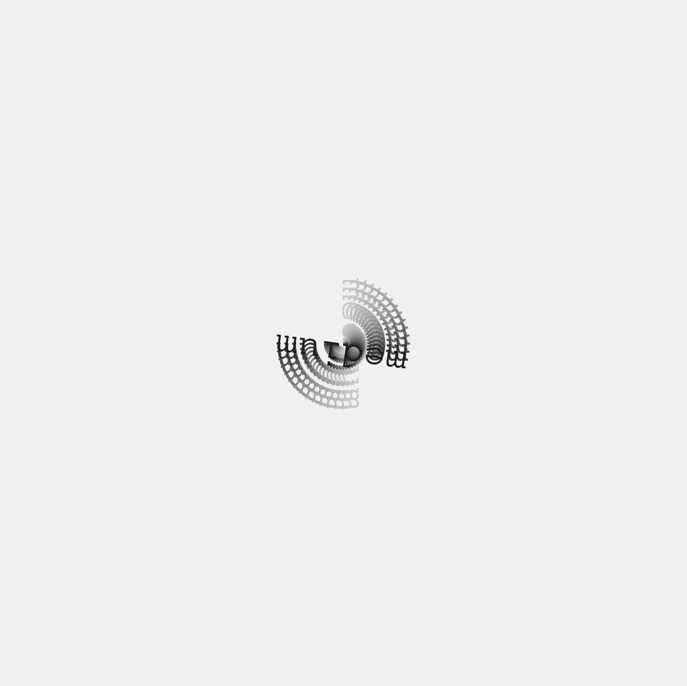
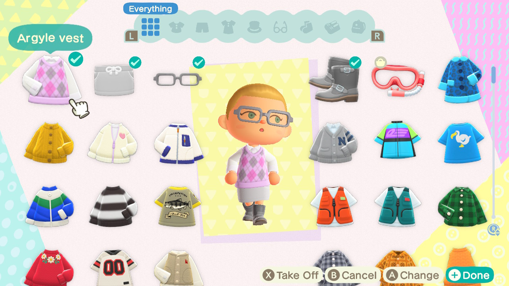

# codewords = code + words, week 04

## Code

For this week, we were taught how to incorporate text into our codes, manipulate it's size <textSize()>, position, alignment<textAlign()> and change the typeface being used <textFont()>. We also explored applying movement and interactivity with the use of the mouse, inserting <mouseX> or <mouseY> for x and y coordinates, instead of definite values. I think the interactive nature helps make the viewer a lot more engaged and excited with what is being presented in front of them. If I were to publish a large chunk of text, incorporating this would help ensure that the viewer would have a better experience.

I really loved the look of moving text, especially in this circular motion. I was suprised with how smooth the end result turned out and got excited to learn about more of the things we could achieve through code. I didn't realise there were so many possibilites and variables we could include. [Here's](https://robymanlongat.github.io/c0dewords/week04/week4type2remix) my remix of this amazing graphic. 

I'm excited to learn about more of the possiblities of coding. Hopefully I'll be able to incorporate these skills into my work in the future, it's definitely something that I don't see a lot of designers working with (not that I know of at least).

## Brief 2

For the rest of this week's lesson, my group and hopped onto Animal Crossing to work on our re-reading of House of Leaves. At the moment, we're still trying to fully understand what's going on in the story - it's super different to anything all of us have read before. The multiple narrators, jumping in and out of different events and the inserts of other texts and passages threw us off a little at the start but we found that breaking the text up into shorter sections helped alot. We are in the process of creating the sets where our characters will be filming on, and the funest part (for me), deciding on each of our outfits. 

*[Here](https://robymanlongat.github.io/c0dewords/week05) for Week05*
