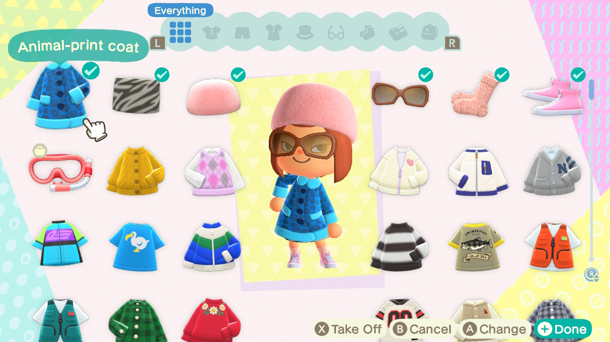

# week 05

## Brief 2

This week we presented our rough outcomes for Brief 2! 

I really loved seeing how different each of the virtual worlds made the text feel. Before this viewing, I thought that the groups who had more choices in customisation of sets/characters etc. would have the best outcomes but it didn't really turn out that way. It only really came down to how well the group adapted to the world and worked with what they had already. There weren't too many things would distract the viewer from focusing on the story and the dialogue.

I enjoyed working with my group and deciding on what adaptions we could make on the cute, family friendly *Animal Crossing* to re-tell the creepy *House of Leaves*. I think one of the biggest challenges we had with working as a group was making sure our internet connections were stable enough to fly to the one island that we ewre filming on. We spent a lot of time in the beggining trying to figure out what our best option was to be able to work as efficiently as possible.

We then discussed Brief 3 and the selection of texts we could chose to focus on. 
