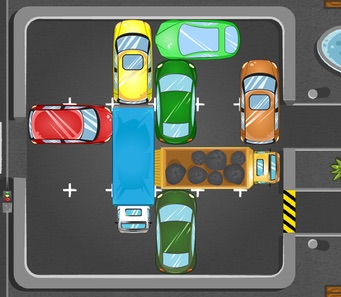
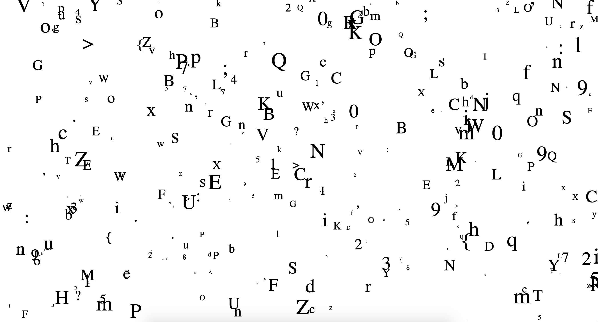
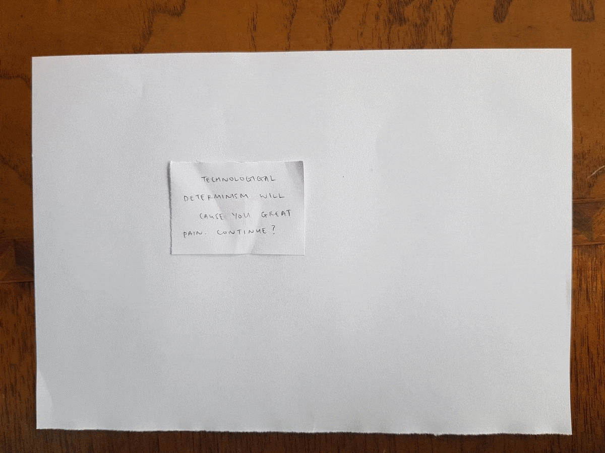

## last week before semester break (week 6)

For this week, we focused on github and creating paper prototypes. We were also taught about presenting large chunks of text in our code and different ways of utilising the movement and scale functions. 

In small groups, we were told to re-create classic video games on paper. My group and I chose *Parking Panic*, and actually found it quite straight forward as the game uses a simple grid and doesn't have too many different variables. I think paper prototyping is very practical and useful. I'll make sure to make some for my future designs so that I can quickly see if I can execute the ideas that I have in my head well enough. 

We were then taught about *pseudo-code* and tried writing some up for our daily actions. I wrote one about waking up; 

  **START** 
  *WHILE 930am THEN alarm goes off* 
  *IF alarm goes off THEN wake up* 
  *ELSE IF no alarm THEN continue sleep* 
  *ELSE IF snooze alarm THEN continue sleep*
  *ELSE IF cat annoys THEN walk to laundry and pour cat food* 
  **END**

I loved this appearing/disappearing effect that Karen taught us. I definitely would like to incorporate this into my re-reading as I think it would suit the text and the text message 'feel' that I want to create.

I created a paper prototype for my re-reading of *OK TEXTS*. The first line of the text will be very static, centre aligned and contained. A big "OK" will appear on top of it. The next line will pop up with a little more movement. An "OK" will appear on top of it, replicating it's movement and position. As more lines appear, more movement, different colours and different scales will be introduced. The very last section of the text will have the most movement, maybe all the words are spread across the screen? Moving in different directions and in different fonts, sizes and colours. 
