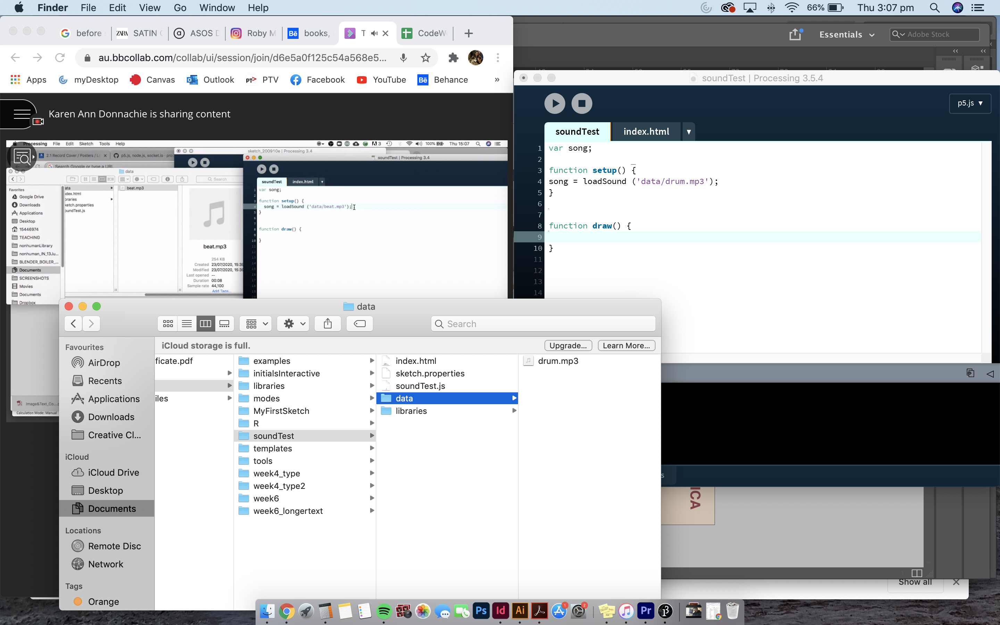

**back from sem break!**

This week, we started our class by revisiting the areas that we covered in the first semester. We then got into groups and shared our paper prototypers to each other, giving feedback and any suggestions that we had. I love when I get to see other people's work, especially when it's still in progess as I am able to learn  so much from them and the things that they think about during development. 

We were then taught about how to incorporate sound into our code and played around with creating some graphics that would go with it. I think I'd like to include sound into my re-reading. Possibly a track that would get louder/more busy as the text goes on and then hits it's loudest part when the last "OK" appears.

Here's my remix of Karen's code that she created for our class. 
