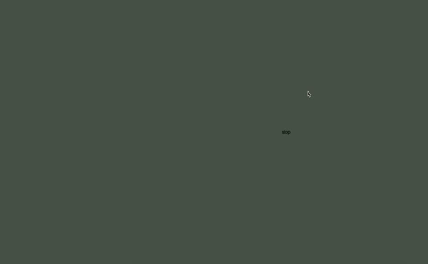

# back from sem break!

## Major Project

This week, we started our class by revisiting the areas that we covered in the first semester. We then got into groups and shared our paper prototypes for our major project to each other, giving feedback and any suggestions that we had. (I decided on going on with my [first idea](https://robymanlongat.github.io/c0dewords/week06/trial1.gif) as I think it has more potential.) My group liked the minimalistic look of it and suggested that we may all want to make changes as we convert it into code and see it running digitally. 

I love when I get to see other people's work, especially when it's still in progess as I am able to learn  so much from them and the things that they think about during development. 

## Code

We were then taught about how to incorporate sound into our code and played around with creating some graphics that would go with it. The commands < loadSound() > < sound.play >, < sound.stop > we're introduced to us. We also incorporated the *mousePressed* function which I think would be a great thing to add to my Major Project, giving the user more control over the experience. I think I'd also like to include sound into my re-reading. Possibly a track that would get louder/more busy as the text goes on and then hits it's loudest part when the last "OK" appears.

## Homework

[Here's](https://robymanlongat.github.io/c0dewords/week07/soundTestRemix) my remix of Karen's sound code that she created for our class this weeek. And here's my pseudo-code for my [paper prototype](https://github.com/robymanlongat/c0dewords/blob/master/week06/trial1.gif): **START** IF text is static and not moving   THEN reply is static and not moving IF text is slighty crooked THEN reply is slighty crooked IF text is moving across the screen THEN reply is moving across the screen IF text is moving along a circle's path THEN reply is moving along a circle's path IF text is spread across the screen THEN reply is spread across the screen **END**

*[Here](https://robymanlongat.github.io/c0dewords/week08) for week08's reflection*
