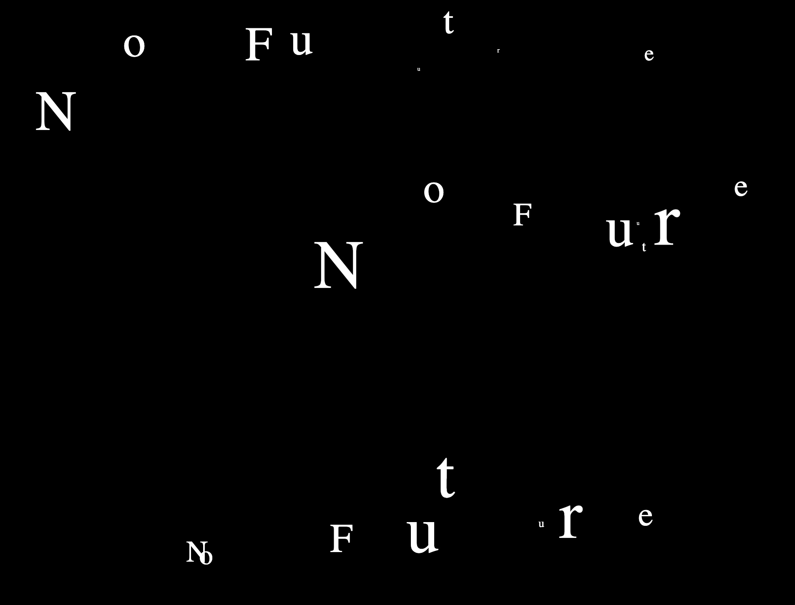

# codewords week08

This week, we began the day by sharing with each other our paper-prototypes and thinking about the possiblities that we could incorporate as we move onto the next steps of creating our codes. As usual, I was so impressed with all the ideas that my other classmates had come up with. I don't know how some of them think of such cool concepts in such a short amount of time. Andy and Karen made me think about how specific and particular I can/*should* be to the typography and the timing in my final presentation as my initial idea is quite minimal. I should also consider including interactivity for a possibly more enganged audience - I was thinking of applying interactive elements to the "OK" at the end of each line?

## Code 

We learnt so much this lesson about some different ways text and just individual letters can be presented through code. We were also introduced to *classes*. At first I was a little confused with understanding this but once we got to see it being used on the code, it became much easier to get. We also incorporated the functions *keyPressed* and *mousePressed*. I found that these made the experience a lot more fun and remarkable, as opposed to if the letters were programmed to appear by themselves. It would be nice to be able to include this into my re-reading; maybe the reader will have to type in "OK" for the next sentence to appear. 
