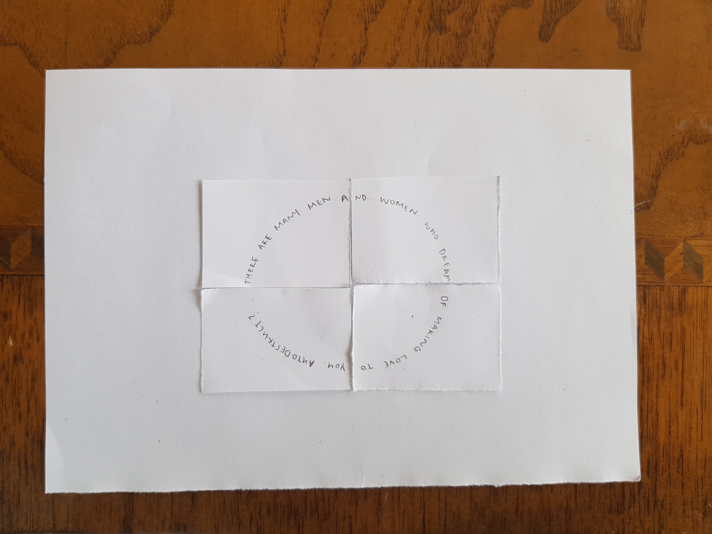
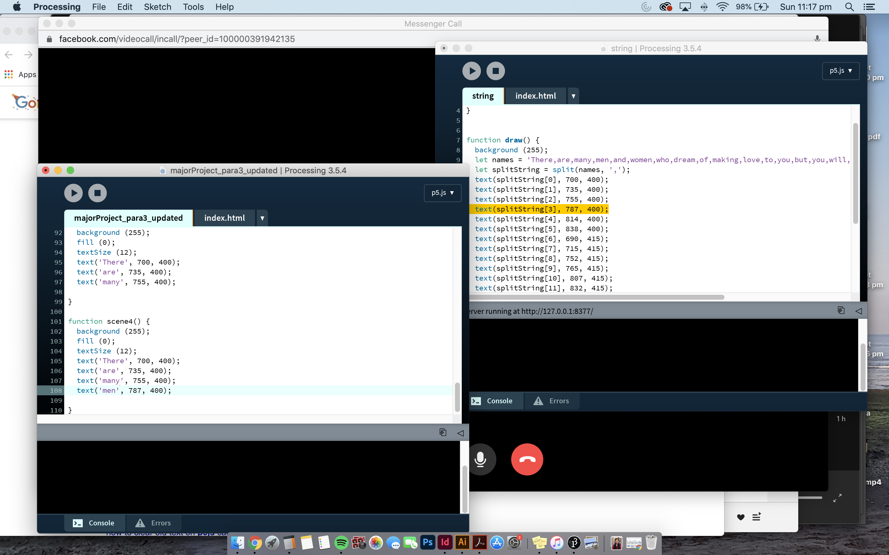

**realisation of due date for Major Project**

I've been coding lots more this week and trying to get as much done as I can for my re-reading. Karen told me about a more efficient way of having multiple events under the *mousePressed* function! Instead I'm using *whichActionVariable*. I've re-written my old codes and also tried to fix any problems that I had. 

Here's my new [para1](https://robymanlongat.github.io/c0dewords/week9.5/majorProject_para1_updated) and [para2](https://robymanlongat.github.io/c0dewords/week9.5/majorProject_para2_updated) 

My initial idea for paragraph 3 was for the sentence to be moving along a circle's path (as shown above), but after seeing a demonstration last week, using *sentenceSplit*, I thought something like [this](https://robymanlongat.github.io/c0dewords/week9.5/majorProject_para3_updated) suited the words more. 

I spent so long trying to let this run using *sentenceSplit* but I couldn't seem to get it to work. After lots of trial and error, I decided not to use variables and just state each word. There's probably a quicker and easier way that I could've done this >:) but I'm really happy with how it turned out so I guess it was worth it!!

While I was browsing for more inspiration, I stumbled across [this](https://editor.p5js.org/doubleshow/sketches/BJdU6tFSM) code and thought it would work great for my paragraph 9. [Here's](https://robymanlongat.github.io/c0dewords/week9.5/majorProject_para9) my remix of it.
