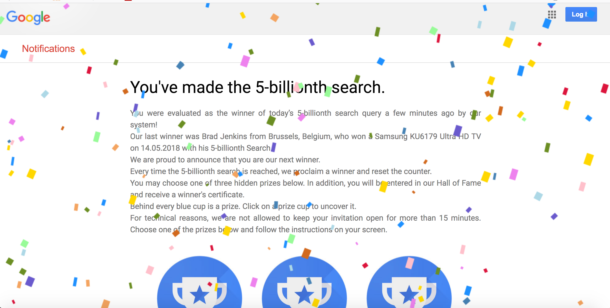

# Week 10! 

## Major Project/ Code

We began class by presenting each of our codes that we've created so far. We put foward any issues or questions that we had and also got some advice from Andy and Karen.

I've combined the codes for paragraphs 1,2 and 3 together! [This](https://robymanlongat.github.io/c0dewords/week10/majorProject_all) is what I showed to everyone. I was a little shy to show such a simple code alongside such cool conceptual work that others had created, but I was surprisingly commended for my approach to start off with super simple graphics and really focus on the details. I think this also allowed me to really own all of my code and truly understand how everything works! This allows me to be able to add onto my work to produce even more exciting results. 

(I've also created some code for other lines of the text. I'm a bit stuck with trying to come up with ideas for other lines, especially line 4. )

[line 6](https://robymanlongat.github.io/c0dewords/week10/majorProject_para6)

[line 7](https://robymanlongat.github.io/c0dewords/week10/majorProject_para7) 

[line 9](https://robymanlongat.github.io/c0dewords/week10/majorProject_para9)

[line 12](https://robymanlongat.github.io/c0dewords/week10/majorProject_para12)

## Homework

During class, Karen and Andy discussed viewing our codes on other devices such as mobile phones. For our codes to work as nicely as they do on our laptops, we shouldn't be using exact points to map out our content. [Here's](https://robymanlongat.github.io/c0dewords/week10/majorProject_resized) my code using relative scaling!!

Right now, I'm in the process of coming up with ideas for what to do with the rest of my text. 

For the last line, I'm thinking of replicating the visuals in the spam/virus pop-ups that tell the user they have won a prize eg. big flashing text, confetti falling (shown in pic above). I like the look of [this](https://editor.p5js.org/FugQueue/sketches/saW0wiHMy) confetti that I found online but I definitely would like for the shapes coming down to be more rectangular so that they look more like actual confetti pieces. 
